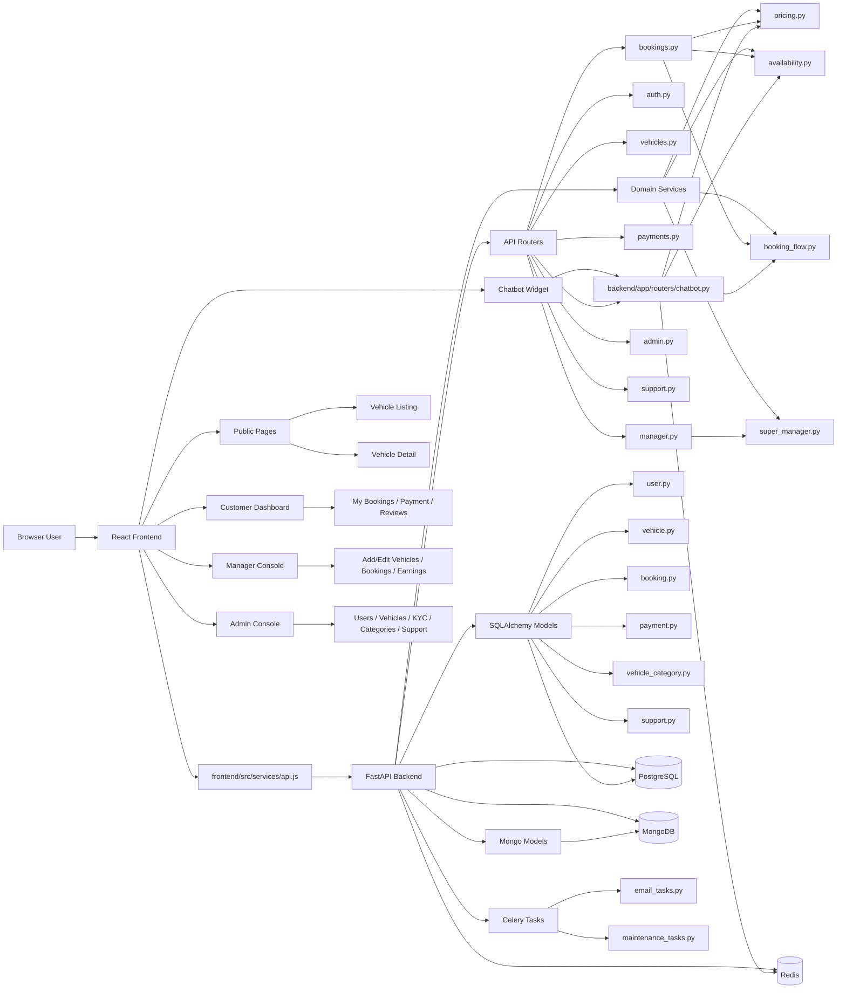
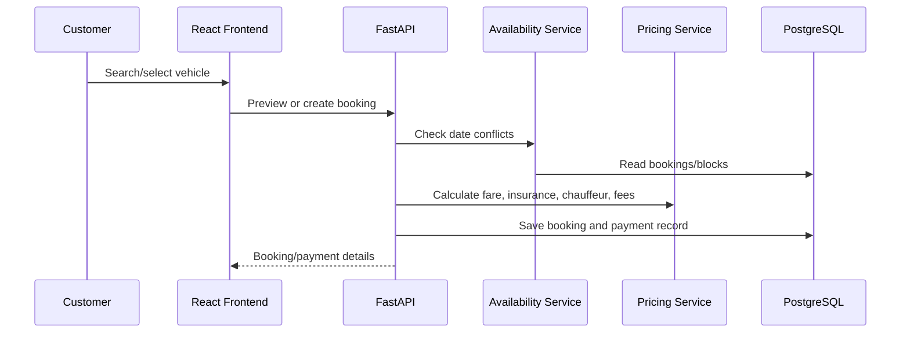
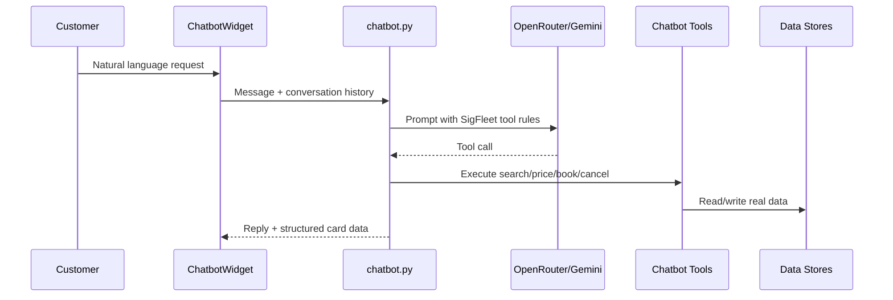

# SigFleet Graph

Generated from `/Users/as-mac-1196/Desktop/gen AI/sigFleet`.

## Key Flows

## Primary Modules

- `frontend/src/App.jsx`: route table and page wiring.
- `frontend/src/components/chatbot/ChatbotWidget.jsx`: customer chat UI and structured result cards.
- `backend/app/main.py`: FastAPI application setup.
- `backend/app/routers/*`: HTTP API surface.
- `backend/app/services/pricing.py`: shared booking price calculations.
- `backend/app/services/availability.py`: vehicle availability and overlap checks.
- `backend/app/services/booking_flow.py`: wallet, payment, booking helper flow.
- `backend/app/models/*`: database schema models.
